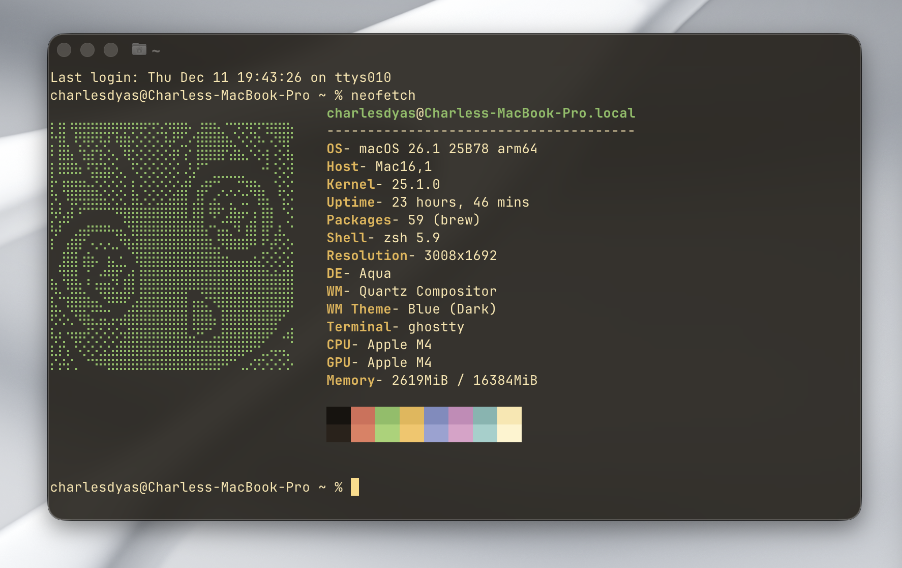

# Ghostty Coffee Theme

A cozy, warm, dark theme for [Ghostty](https://github.com/ghostty-org/ghostty) inspired by roasted coffee beans, crema, and homebrew.

## Preview



## Features

- **Background**: Deep roasted coffee bean (#211c16)
- **Foreground**: Creamy latte foam (#fbe6b2)
- **Accents**: Warm earthy tones, soft greens, and vibrant roasts.
- **Vibe**: Relaxed, high contrast but easy on the eyes.

## Installation & Usage

### ⚡️ Quick & Clean (Recommended)

1.  Download `coffee-theme.conf` and place it in your Ghostty config folder (usually `~/.config/ghostty/`).
    
    ```bash
    # You can run this one-liner to download it directly:
    curl -o ~/.config/ghostty/coffee-theme.conf https://raw.githubusercontent.com/dyascj/ghostty-coffee-theme/master/coffee-theme.conf
    ```

2.  Add this line to your Ghostty config file (`~/.config/ghostty/config`):

    ```ini
    config-file = coffee-theme.conf
    ```

3.  Restart Ghostty! ☕️

### 📂 Organized Method (Subfolder)

If you prefer to keep themes in their own folder:

1.  Clone this repo into `~/.config/ghostty/themes/`.
2.  In your config, point to the full path:
    ```ini
    config-file = ~/.config/ghostty/themes/ghostty-coffee-theme/coffee-theme.conf
    ```

## Customization

Feel free to adjust the `background-opacity` and `background-blur-radius` in the config file to match your preferred level of transparency and blur.

```ini
background-opacity = 0.70
background-blur-radius = 30
```

## License

MIT License. See [LICENSE](LICENSE) for details.

